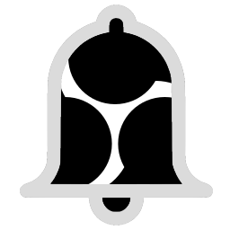
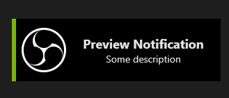
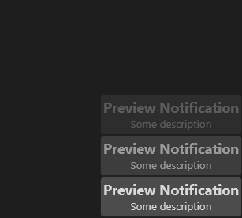
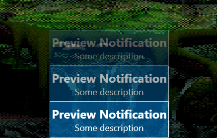
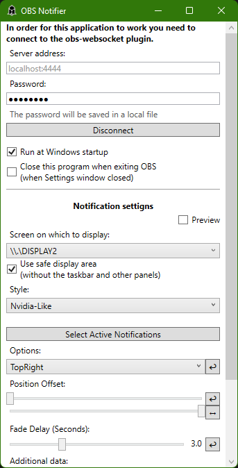
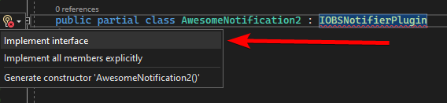
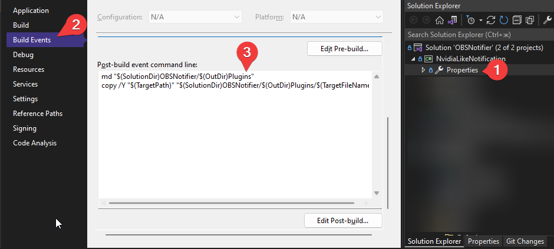

# OBS Notifier



This is a program for displaying notifications from OBS.
In order for the program to work, you need to install the [obs-websocket](https://github.com/obsproject/obs-websocket/releases/tag/4.9.1) or [obs-websocket-compat (for OBS 28)](https://github.com/obsproject/obs-websocket/releases/tag/4.9.1-compat) plugin in your OBS.

## Important

**The "Replay Saved" notification does not work without using the modified version of obs-websocket 4.9.1 plugin.** Because in obs-websocket 4.9.1 there is no support for the "ReplaySaved" event, and 4.9.1 is used because upgrading to version 5 is still in progress.

For more information on how to install this program and get working notifications about saving replays, [read this article](https://dmitriysalnikov.itch.io/obs-notifier/devlog/335353/how-to-install-obs-notifier).

<h2><a href="#Support">Download</a></h2>

## Features

* Supports `obs-websocket` 4.9.1 or 4.9.1-compat
* Plugin system
* Separate settings for each plugin
* Adjusting the position and offsets of notifications
* Configurable notification display time
* Ability to choose which types of notifications to display
* Ability to set custom settings
* Highly customizable default plugin
* Nvidia-like plugin out of the box

## Screenshots










## Support

[](https://ko-fi.com/I2I53VZ2D)

[](https://paypal.me/dmitriysalnikov)

[](https://qiwi.com/n/DMITRIYSALNIKOV)

## Download

The binaries of the latest version are available on [**itch.io**](https://dmitriysalnikov.itch.io/obs-notifier) or on the [**Github Releases page**](https://github.com/DmitriySalnikov/OBSNotifier/releases/latest).

## Plugin Development

To make your own plugin, you need to create a library where `IOBSNotifierPlugin` interface will be implemented and exported.
So you need to add a reference to OBSNotifier.exe or to the OBSNotifier project.

```csharp
using OBSNotifier;
using OBSNotifier.Plugins;
using System.ComponentModel.Composition;
using ...;

namespace AwesomeNotification
{
    [Export(typeof(IOBSNotifierPlugin))]
    public partial class MyAwesomeNotification : IOBSNotifierPlugin
    {
        // Interface implementation here
    }
}
```

**Tip:** For faster implementation of all the methods and properties of the plugin, you can simply place the text cursor on the interface name and press ALT + Enter, then select `Implement interface`.



To position the notification window, you can use the `OBSNotifier.Utils.GetWindowPosition()`. Or just use other functions from the `Utils`.

Also, for more information, you can view the code of the default plugin or `Nvidia-like` plugin in the `Plugins/NvidiaLikeNotification/` folder

To test the plugin, place your dll in the `OBSNotifier/Plugins` folder with installed program, or to a subdirectory, for example `OBSNotifier/Plugins/MyAwesomePlugin/Plugin.dll`.

**Tip:** For ease of development, you can add the command `copy /Y "[your dll]" "[target path]"` in post-build actions ([example](https://github.com/DmitriySalnikov/OBSNotifier/blob/463fcb63f6b07c6a80df4b9cc70f41ccd6f405c8/Plugins/NvidiaLikeNotification/NvidiaLikeNotification.csproj#L106)).



## License

MIT license
